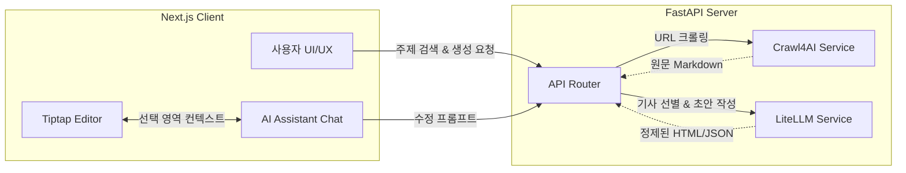

# Mercury (AI 뉴스레터 자동 생성기)

> 크롤링부터 초안 작성, 에디터 내 AI 어시스턴트 편집까지 한 번에 해결하는 AI 뉴스레터 제작 플랫폼

[](https://nextjs.org/)
[](https://fastapi.tiangolo.com/)
[](https://github.com/unclecode/crawl4ai)
[](https://github.com/BerriAI/litellm)

## 📖 프로젝트 개요 & 동기

**어떤 문제를 해결하는가?**
매주 트렌디한 테크/IT 뉴스레터를 발행하려면 수많은 기사를 읽고 선별한 뒤, 요약하고 포맷팅하는 데 막대한 시간이 소요됩니다. Mercury는 이 과정을 자동화하여, 키워드 입력만으로 고품질 뉴스레터를 생성하고 편집할 수 있는 올인원 작업 환경을 제공합니다.

**기존 해결책과의 차별점**
단순히 기사를 요약해주는 것을 넘어, **에디터에 AI 챗 어시스턴트가 내장**되어 있습니다. 사용자는 생성된 뉴스레터 초안을 보며 "이 부분의 어투를 더 부드럽게 바꿔줘" 또는 "이 단락을 3줄로 요약해줘"와 같이 AI와 대화하며 실시간으로 문서를 수정할 수 있습니다.

---

## 🛠 기술 스택

### Frontend
| 기술 | 선택 이유 |
| --- | --- |
| **Next.js (React)** | SSR 및 최적화된 라우팅과 컴포넌트 기반 UI 개발을 위해 사용 |
| **Tailwind CSS & shadcn/ui** | 유려하고 일관된 디자인 시스템을 빠르고 세밀하게 구축하기 위해 도입 |
| **Tiptap** | AI 어시스턴트와 상호작용 가능한 유연한 Rich-Text 에디터 구현을 위해 선택 |
| **React Query** | 비동기 상태 관리 및 백엔드 API와의 원활한 데이터 동기화 |

### Backend
| 기술 | 선택 이유 |
| --- | --- |
| **FastAPI (Python)** | 비동기 처리(asyncio) 기반의 빠르고 가벼운 API 서버 구축 |
| **Crawl4AI** | 안티봇 우회 및 마크다운 기반의 깔끔한 본문 추출 성능 확보 |
| **LiteLLM (Gemini)** | 여러 LLM 모델을 표준화된 API로 호출하고, AI 기반 기사 필터링 및 본문 생성을 위해 사용 |

---

## ✨ 주요 기능

- **지능형 기사 검색 및 필터링**
  입력된 주제에 맞춰 빙(Bing) 뉴스를 검색하고, 단순 실적/주가 기사나 광고성 페이지를 1차로 필터링합니다.
- **AI 큐레이션**
  LLM이 후보 기사들을 분석하여 테크/IT 종사자가 가장 흥미로워할 만한 핵심 기사만을 선별합니다.
- **자동 초안 생성**
  선택된 기사들의 본문을 크롤링하여, 뉴스레터 포맷에 맞춘 HTML 초안을 자동 생성합니다.
- **AI 어시스턴트가 결합된 인라인 에디터**
  에디터에서 특정 텍스트를 드래그한 후 우측 AI 챗창에 수정 사항을 지시하면, AI가 해당 부분만 알맞게 재작성하거나 전체 초안을 다듬어 줍니다.

*(스크린샷 추가 예정)*
``
``

---

## 🏛 아키텍처 & 설계 결정



### 핵심 설계 결정 및 트레이드오프
1. **비동기 크롤러 도입 (Crawl4AI)**
   - **이유**: 빠르고 정확한 본문 추출을 위해 마크다운 변환 기능이 내장된 비동기 크롤러를 선택했습니다.
   - **트레이드오프**: 초기 브라우저 인스턴스 로딩과 메모리 사용량이 다소 높지만, 병렬 처리(`asyncio.gather`)를 통해 전체 수집 속도를 보완했습니다.
2. **에디터와 AI의 결합 방식**
   - **이유**: 별도의 창을 오가며 복사/붙여넣기 하는 피로를 줄이기 위해, Tiptap 에디터의 Selection State를 AI 채팅 패널과 실시간 동기화시켰습니다.

---

## 🚀 설치 & 실행 방법

### 필수 환경
- Node.js 20+
- Python 3.10+

### 1. 백엔드 설정
```bash
cd backend
python -m venv venv
source venv/bin/activate  # Windows: venv\Scripts\activate
pip install -r requirements.txt # (의존성 설치)

# 환경변수 설정
cp .env.example .env
# .env 파일에 LITELLM_API_KEY 등을 입력하세요.

# 실행 (개발 모드)
uvicorn app.main:app --reload
```

### 2. 프론트엔드 설정
```bash
cd frontend
npm install

# 실행 (개발 모드)
npm run dev
```

> **Tip:** `frontend` 디렉토리에서 `npm run dev:all` 명령어를 사용하면 백엔드와 프론트엔드를 동시에 실행할 수 있습니다. (package.json 설정 참고)

---

## 🐞 트러블슈팅 & 회고

### 트러블슈팅
1. **크롤링 타임아웃 및 봇 차단 문제**
   - **상황**: 특정 언론사 사이트에서 403 에러나 무한 로딩이 발생함.
   - **원인**: 단순 HTTP 요청 차단 및 렌더링 지연.
   - **해결**: Crawl4AI의 `magic=True` 옵션을 활용하여 기본 봇 차단을 우회하고, 15초 타임아웃을 설정해 지연되는 요청은 빠르게 포기 후 다음 후보로 넘어가도록 예외 처리를 강화했습니다.

2. **LLM 응답 포맷 오류**
   - **상황**: 기사 선별 시 LLM이 JSON 형식이 아닌 일반 텍스트나 마크다운 코드블록을 섞어 반환하여 파싱 에러 발생.
   - **해결**: 정규표현식(`re.sub`)을 통해 앞뒤의 ` ```json ` 마크다운 태그를 강제로 제거하고, pydantic 기반의 모델 검증(`model_validate_json`)과 재시도 로직(Retry)을 구현하여 안정성을 높였습니다.

### 회고
- **잘 된 점**: 프론트엔드에서 Tiptap 에디터와 AI 채팅 기능을 부드럽게 연동하여 UX를 크게 향상시켰습니다.
- **아쉬운 점**: 뉴스 검색을 빙(Bing) RSS에 의존하다 보니, 특정 니치한 주제에 대해서는 검색 결과 풀(Pool)이 좁은 한계가 있습니다. 향후 Google News API나 트위터 크롤링을 결합하면 좋을 것 같습니다.
- **배운 점**: 비동기 파이썬(FastAPI+Asyncio) 생태계에서 스트리밍 응답과 병렬 웹 스크래핑을 안정적으로 제어하는 방법을 깊이 이해하게 되었습니다.